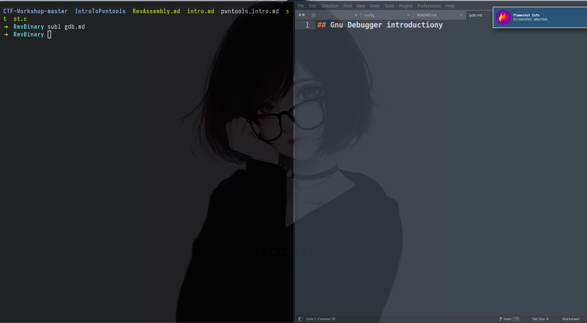

# Kali-i3-customization
This is my Kali Linux i3-gaps customization dotfiles.
This installer can help you to install it in you Linux Systems




## SETUP
Clone this repository and then just type:

```shell
bash installer.sh
```

Don't interupt the script execution...

---
After the installation, Reboot your machine and on login Select `i3`.
- When your system is up. open the Terminal using 
`Win+Enter` and then run `lxappearance` and Select arc-dark
Now just find some Background wallpaper and set them using the command :
 ```shell
feh --bg-scale background.jpg
```

If You want to see all your applications like Firefox and others use :
`Win+d`

